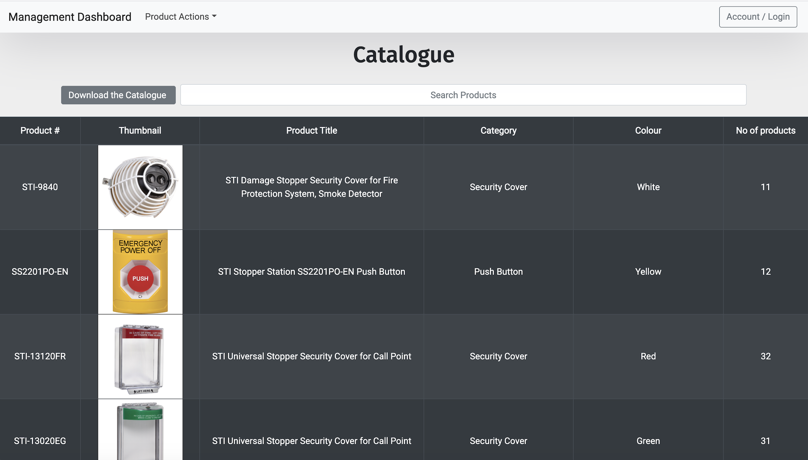
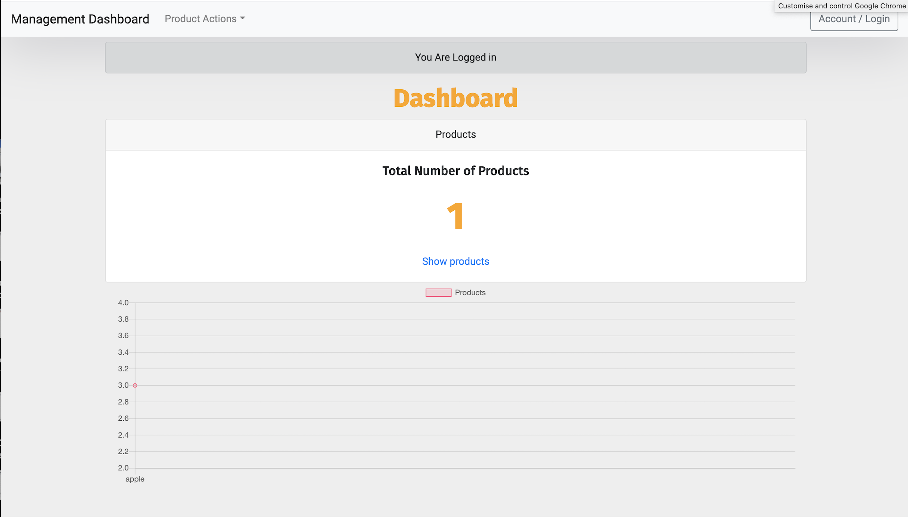

# Project 3

## Group 2:
George Robertshaw. robertsicher

Rekha Kumari. Nikstar-1
​
​
## Project Title: 

Product Manager 
​
## Website Title and Description
​
Product Manager
MERN application 
​
An app to for companies to internally manage the products that they are listing on distributors sites so they can 

easily upload, store and download information as CSV’s in order to create listings on other websites.
​
​
The website can be found at the following address: https://desolate-chamber-36305.herokuapp.com/
​
## Who is our audience? 
​
Business Users
​
## User Story: 

As a company that works on a distributor model, we are frequently getting asked for data on products, in order for

them to be frequently relisted on multiple different sites

## What is the problem the product is going to address? 

Product manager helps to create an internal central database for products, where products can be added, via form or 

csv for mass imports, edited, and deleted, then exported as a csv to be distributed
​
## How does the product solve the problem?
​
It allows for products to be added, edited and exported in order to pass these along to distributors and resellers.

Suitable for any company.
​
​
## What were the technologies used?
​
Back End:
Express
Node.js
Heroku
Cloudinary
Mongoose
MongoDB
​
Front End:
React
React Bootstrap
React Charts
React-CSV
Flatfile
Cloudinary
​
## Installation
To run the application locally, first clone this repository with the following command.
​
git clone https://github.com/Nikstar-1/Product_Managment_Database
​
Next, install the application dependencies.
​
npm install
Finally, run the node server locally.
​
node server
Now, open the local application on port 3000 at the URL: http://localhost:3000/.
​
​
## Tasks 
​
George Robertshaw. robertsicher Front End, Product Backend, CSV download & upload, HTML Routing
​
Rekha Kumari. Nikstar-1 Cloudinary, React chart, Auth / Login, CSS, Front End, Heroku Deploy
​
​
## Screenshots
​

​

​

## License
Licensed under the MIT License.

A short and simple permissive license with conditions only requiring preservation of copyright and license notices. Licensed works, modifications, and larger works may be distributed under different terms and without source code.

MIT license
